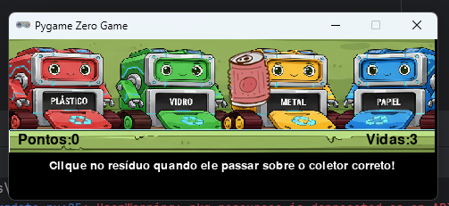

# 🎮 Jogo Educativo – Coleta Seletiva

Aplicação desenvolvida com **Python e Pygame Zero** com foco em lógica de programação, controle de estado e manipulação de eventos.

O jogo simula um sistema de coleta seletiva onde o usuário deve clicar no resíduo correto no momento adequado, associando cada material ao seu respectivo coletor.

---

## 🖥️ Preview

---

## 🧠 Conceitos Aplicados

- Manipulação de eventos de mouse e teclado
- Controle de estado (pontuação e vidas)
- Randomização de objetos
- Feedback visual e sonoro
- Estrutura condicional para validação de regras
- Reinicialização de estado do sistema

---

## ⚙️ Tecnologias Utilizadas

- Python
- Pygame Zero

---

## ▶️ Como Executar

1. Instalar o Pygame Zero:
      pip install pgzero
2. Execute o arquivo do jogo:
      pgzrun jogo.py

   
